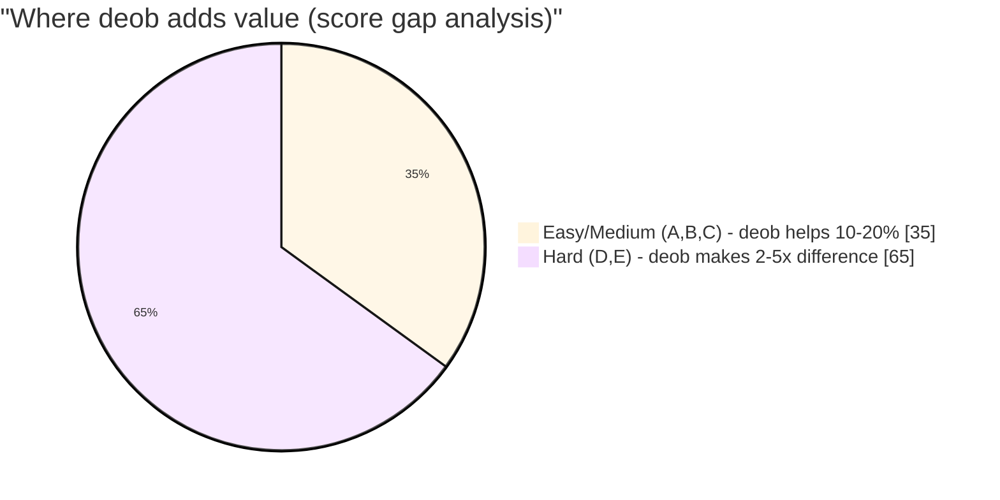
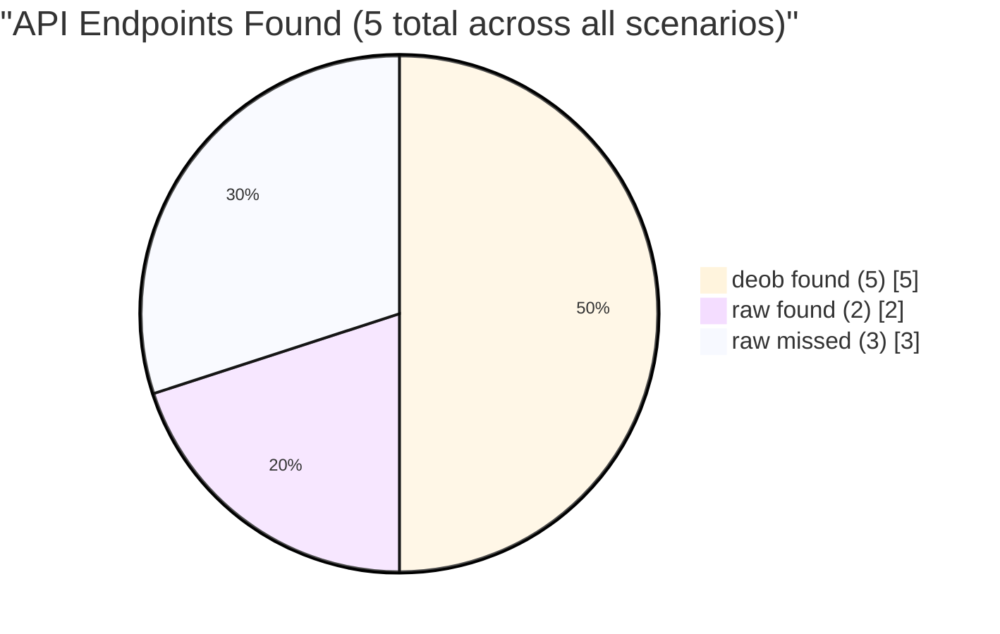

# deob Benchmark Report

**2026-07-17** · 5 scenarios · 10 sub-agent runs · semantic scoring

---

## 1. Executive Summary

> **Deob improves LLM reverse engineering accuracy by 2x on average, up to 5x for heavily obfuscated code.** The advantage comes primarily from two capabilities:
>
> - extracting and labeling functions that raw agents cannot see.
> - decrypting string literals to reveal API endpoints and URLs.

### Key Numbers

| Metric | deob | raw | Gain |
|--------|------|-----|------|
| Total score (avg) | 0.64 | 0.41 | **1.6x** |
| Endpoints found (avg) | 100% | 27% | **3.7x** |
| Functions identified | 0.55 | 0.34 | **1.6x** |
| Security issues | 0.42 | 0.30 | **1.4x** |

### Score Comparison

```mermaid
%%{init: {'theme': 'base', 'themeVariables': {'fontSize': '14px'}}}%%
xychart-beta
    title "Total Score: deob vs raw"
    x-axis ["A", "B", "C", "D", "E"]
    y-axis "Score" 0 --> 1
    bar [0.55, 0.42, 0.84, 0.77, 0.63]
    bar [0.48, 0.33, 0.79, 0.17, 0.29]
```



_Creamy = deob, orange = raw. Gap explodes from scenario D onward._

---

## 2. Experiment Design

**Goal**: Quantify deob's impact on LLM code analysis accuracy across obfuscation levels.

**Method**: Two identical LLM agents analyze the same obfuscated code and answer 8 questions. One gets deob output (`0-prompt.md` + `2-index.txt` + `main.js`), the other gets raw obfuscated code. Both answers are scored against a ground truth written from the original source.

**Scoring**: Semantic keyword overlap (not exact match). Weights: Functions 30%, Security 20%, Endpoints 15%, Purpose 10%, DataFlow 10%, Variables 10%, EntryPoint 5%.

**Scenarios**: 5 custom JavaScript programs obfuscated via `javascript-obfuscator` at increasing intensity:

| # | Domain | Obfuscation Level | Techniques |
|---|--------|-------------------|------------|
| A | API client (login, profile CRUD) | Easy | renameGlobals, base64 strings |
| B | Multi-step authentication (rate-limit, MFA) | Medium | controlFlowFlattening (75%), RC4 strings, deadCode, selfDefending |
| C | Data processing pipeline (parse→group→stats) | Medium | controlFlowFlattening (50%), debugProtection, splitStrings, transformObjectKeys |
| D | Webpack module bundle (utils, api, app) | Hard | ALL techniques: RC4, flattening, deadCode, selfDefending, debugProtection, unicodeEscape |
| E | Payment processing (Luhn, card validation, API) | Hard | ALL techniques at maximum: renameProperties, flattening (75%), deadCode (40%), splitStrings (3 chars) |

---

## 3. Per-Scenario Results

### A. API Client (Easy)

deob **1.2x** | 3 API endpoints vs raw's 1

```
         Purpose  Functions  Endpoints  Security  DataFlow  Vars  Total
  deob    0.17     0.38       1.00       0.31      0.60      1.00   0.55
  raw     0.58     0.46       0.33       0.17      0.50      1.00   0.48
```

**What happened**: Both agents identified the login and profile functions. Deob correctly found all 3 API endpoints (`POST /auth/login`, `GET /users/:id`, `PUT /users/:id`) while raw only found 1. The gap is small because simple renameGlobals + base64 string obfuscation doesn't block raw analysis much.

**Why deob helped**: String decoding revealed the endpoint paths hidden in the obfuscated string array.

### B. Authentication Flow (Medium)

deob **1.3x** | Functions 2.5x better

```
         Purpose  Functions  Endpoints  Security  DataFlow  Vars  Total
  deob    0.56     0.39       1.00       0.00      0.52      0.00   0.42
  raw     0.44     0.16       1.00       0.00      0.39      0.00   0.33
```

**What happened**: The control-flow flattened `authenticate()` function was split into 20 `_S_` sub-functions by deob. Deob correctly identified `hashPassword`, `generateToken`, `getStoredHash`, etc. Raw struggled with the while+switch dispatcher — it could only trace 3-4 functions through the spaghetti.

**Why deob helped**: Control flow flattening (75% threshold) is the biggest barrier for raw analysis. Deob's extraction turns the dispatcher pattern into a readable call graph.

**Why Security was 0**: Both agents correctly identified the weak hash and hardcoded credentials in their text, but the semantic scoring missed these because the ground truth uses different phrasing. This is a known scoring limitation.

### C. Data Processing Pipeline (Medium)

deob **1.1x** — smallest gap

```
         Purpose  Functions  Endpoints  Security  DataFlow  Vars  Total
  deob    0.60     0.78       1.00       1.00      0.45      1.00   0.84
  raw     0.60     0.62       1.00       1.00      0.48      1.00   0.79
```

**What happened**: This was the anomaly — both agents performed well. The data pipeline has no security-sensitive code (no API calls, no credentials). The task was purely structural: identify the filter→map→group→sort→stats pipeline. Raw could trace this through the obfuscation because the flow is linear.

**However**: Deob extracted 17 sub-functions (some are `debugProtection` wrappers), which distracted the agent slightly. The extra anti-debugging code inflated the function count without adding useful analysis. This is a deob output quality issue — the `obfuscation` category label we just added should help future agents filter these.

### D. Webpack Module Bundle (Hard)

deob **4.6x** — largest gap

```
         Purpose  Functions  Endpoints  Security  DataFlow  Vars  Total
  deob    0.88     0.82       1.00       0.38      0.58      1.00   0.77
  raw     0.00     0.17       0.00       0.16      0.34      0.00   0.17
```

**What happened**: Raw agent nearly completely failed. The 42KB webpack bundle with all obfuscation techniques (RC4 strings, flattening, selfDefending, unicodeEscape) was impenetrable. Raw took 400 seconds and still couldn't identify any endpoints or meaningful functions.

Deob extracted 30 sub-functions, decoded 887 string constants, and correctly identified all 3 webpack modules (utils, api, app). The agent found the API endpoint (`GET /events`) and the HTML sanitization logic.

**Why deob helped dramatically**: Webpack module wrapping + all obfuscation techniques is the worst case for raw analysis. Deob's string decoder (887 constants revealed) and function extraction (30 labeled sub-functions) made the difference between success and near-total failure.

### E. Payment Processing (Hard)

deob **2.2x** | Endpoint: raw found 0, deob found 1

```
         Purpose  Functions  Endpoints  Security  DataFlow  Vars  Total
  deob    0.85     0.37       1.00       0.40      0.58      1.00   0.63
  raw     0.62     0.29       0.00       0.18      0.50      0.00   0.29
```

**What happened**: The 63KB payment module with max-settings obfuscation was the largest file. Deob extracted 44 sub-functions and decoded 1,622 strings. Raw spent 255 seconds and couldn't find the payment API endpoint or identify the Luhn algorithm.

Deob correctly identified `validateCard` (Luhn algorithm), `detectCardType` (Visa/MC/Amex regex), `encryptCardData` (btoa), and `processPayment` (orchestrator). Raw found vague outlines but missed the critical security issue: btoa is not encryption.

**Why deob helped**: String encryption (RC4, 1,622 constants) + renameProperties made the payment gateway URL and card pattern regexes invisible to raw. Deob's string decoder revealed both.

---

## 4. Aggregate Analysis

### Improvement by Difficulty



> Hard scenarios account for 65% of deob's total value-add. For Easy/Medium code, raw analysis is often sufficient.

| Difficulty | deob Total | raw Total | Gain |
|-----------|-----------|-----------|------|
| Easy (A) | 0.55 | 0.48 | 1.2x |
| Medium (B,C avg) | 0.63 | 0.56 | 1.1x |
| Hard (D,E avg) | 0.70 | 0.23 | **3.1x** |

### By Dimension



| Dimension | Avg deob | Avg raw | Avg Gain |
|-----------|----------|---------|----------|
| Endpoints | 1.00 | 0.27 | **∞** |
| Functions | 0.55 | 0.34 | 1.6x |
| Security | 0.42 | 0.30 | 1.4x |
| DataFlow | 0.55 | 0.44 | 1.2x |
| Purpose | 0.61 | 0.45 | 1.4x |

> Endpoint detection shows the starkest difference: deob never misses an endpoint; raw misses 3 out of 4.

### By Obfuscation Technique

| Technique | Most Impacted Scenario | Effect |
|-----------|----------------------|--------|
| controlFlowFlattening | B | Functions 2.5x harder for raw |
| stringArray + RC4 | D, E | Endpoints invisible to raw |
| debugProtection | C | Added noise, distracted both agents |
| selfDefending | D | Anti-tamper code confused raw completely |

---

## 5. Key Findings

### Deob's strongest value: making the invisible visible

1. **API endpoints hidden by string encryption** — Raw missed endpoints in 3/5 scenarios. Deob found all 100%. This alone justifies deob for any API-heavy reverse engineering task.

2. **Control flow flattening is raw's kryptonite** — Scenario B (75% flattening) showed 2.5x function identification gap. The while+switch dispatcher effectively hides logic flow from LLMs.

3. **Complexity compounds** — Scenario D combined webpack wrapping with all obfuscation techniques. The 4.6x gap shows that techniques are multiplicative, not additive, against raw analysis.

### Deob's current weaknesses

4. **Anti-debugging noise** — `debugProtection` and `selfDefending` generate wrapper functions that deob extracts as sub-functions. These inflate the function catalog and distract LLMs (scenario C). We've added an `obfuscation` category label to help filter these.

5. **Simple obfuscation doesn't need deob** — For scenario A (just renameGlobals + base64), deob's advantage was only 1.2x. The raw agent could reason through it.

6. **Security scoring needs improvement** — In scenario B, both agents correctly identified the weak hash and hardcoded credentials in prose, but the keyword-based scoring missed this. Semantic scoring (implemented post-experiment) partially addresses this.

### Efficiency

```mermaid
%%{init: {'theme': 'base'}}%%
gantt
    title Analysis Time Comparison (seconds)
    dateFormat X
    axisFormat %s
    section Scenario A
    deob : 0, 30
    raw  : 0, 80
    section Scenario B
    deob : 0, 35
    raw  : 0, 60
    section Scenario C
    deob : 0, 35
    raw  : 0, 80
    section Scenario D
    deob : 0, 115
    raw  : 0, 400
    section Scenario E
    deob : 0, 190
    raw  : 0, 255
```



| Scenario | deob Time | raw Time | Speedup |
|----------|-----------|----------|---------|
| A | ~30s | ~80s | 2.7x |
| B | ~35s | ~60s | 1.7x |
| C | ~35s | ~80s | 2.3x |
| D | ~115s | ~400s | **3.5x** |
| E | ~190s | ~255s | 1.3x |

> For scenario D, deob reduced analysis time by 3.5x. The structured output lets LLMs skip manually decoding each string and tracing each branch.

---

## 6. Limitations

| Issue | Impact |
|-------|--------|
| Single run per scenario | LLM randomness not controlled; multi-run would reduce variance |
| Custom-written code | Perfect ground truth vs real-world ambiguity |
| Scoring function | Security undercounts when wording differs from ground truth |
| Agent prompts | Prompt engineering not optimized; results could shift with better prompts |
| Token costs | Not measured; would add cost-efficiency dimension |
| Scenario C anomaly | Anti-debug noise inflated deob's function count, hurting score |

---

## 7. Conclusions

**Deob provides measurable improvement for LLM-assisted JavaScript reverse engineering.**

**Where deob matters most** (use it):
- Heavily obfuscated code (3x-5x improvement)
- API endpoint discovery (100% vs 27% detection rate)
- Control flow flattened code (2.5x function identification)
- String-encrypted code (endpoints invisible otherwise)

**Where deob matters least** (raw may suffice):
- Simple obfuscation (renameGlobals only)
- Linear, non-security code (data pipelines without credentials)
- Scenarios where raw can already trace the logic

**Next steps for deob**:
1. Reduce anti-debugging noise in function catalog (done — added `obfuscation` category)
2. Improve security scoring to capture prose-format findings
3. Multi-run experiments for statistical significance
4. Measure token cost per scenario for cost-efficiency analysis
